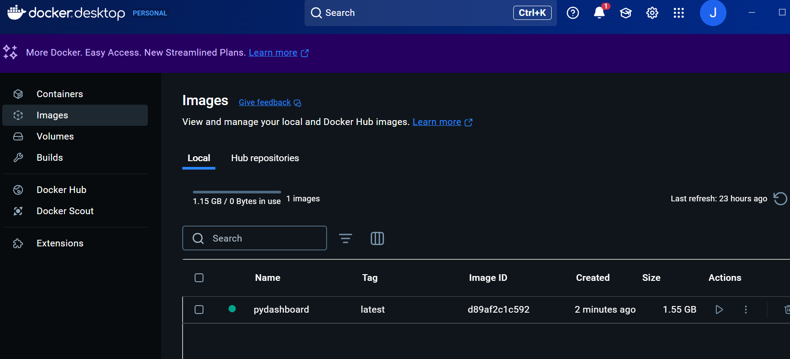
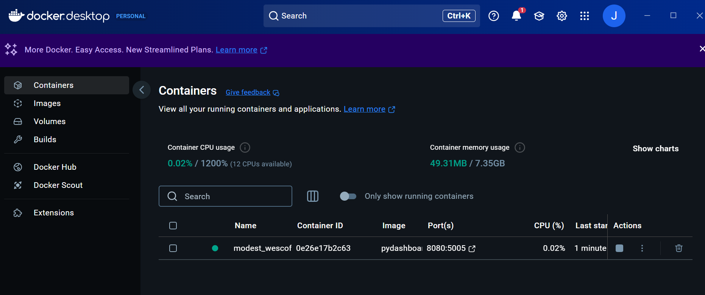
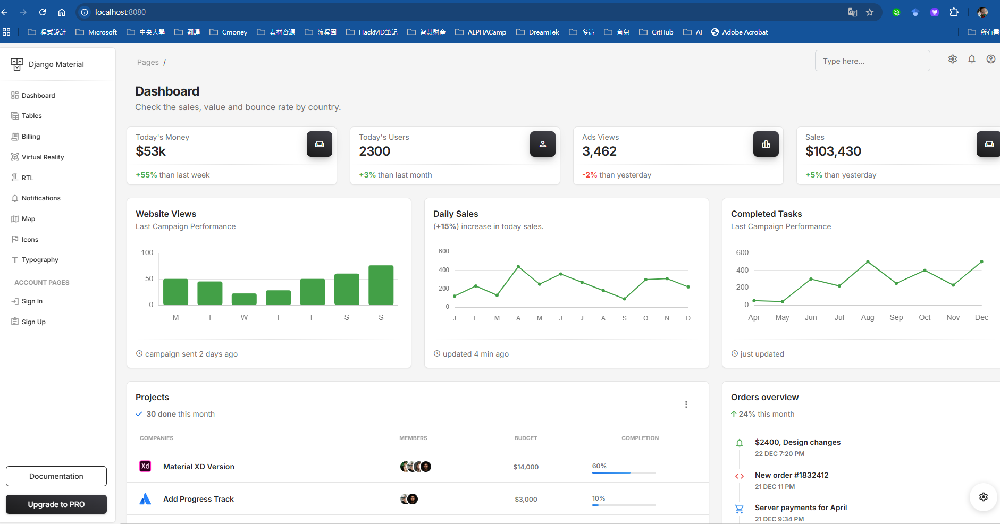
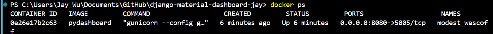
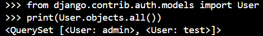
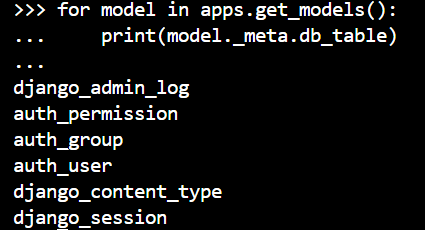
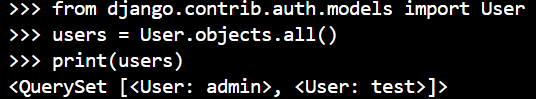
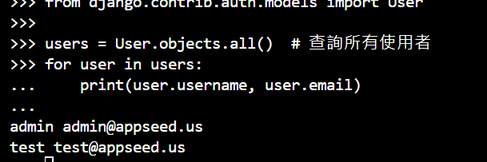

# django-material-dashboard-jay
 

## `Docker commands`
- 1. Build: `docker build -t pydashboard .`

- 2. Run: `docker run -p 8080:5005 -d pydashboard`

- 3. 進入http://localhost:8080/

## `Docker 查詢資料庫`
1. 查詢容器ID`docker ps`

2. 進入容器`docker exec -it 0e26e17b2c63 bash`
3. 進入 Django Shell`python manage.py shell`
4. 查詢資料庫`from django.contrib.auth.models import User 
print(User.objects.all())`

5. 查看Table`from django.apps import apps
for model in apps.get_models():
    print(model._meta.db_table)`

6. 查詢每個Table的資料`from django.contrib.auth.models import User
users = User.objects.all()
print(users)`

7. 查詢所有使用者`from django.contrib.auth.models import User

users = User.objects.all()
for user in users:
    print(user.username, user.email)`

## 發布至Render

issue: reder.yaml 修改`startCommand: "gunicorn core.wsgi:application --bind 0.0.0.0:10000"`

https://django-material-dash2-latest-vbk2.onrender.com